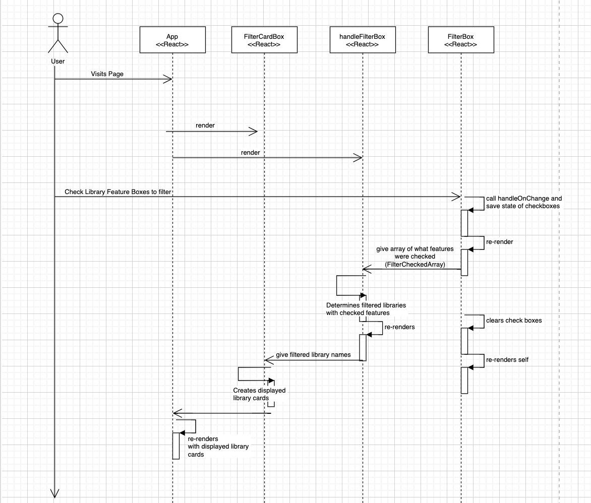
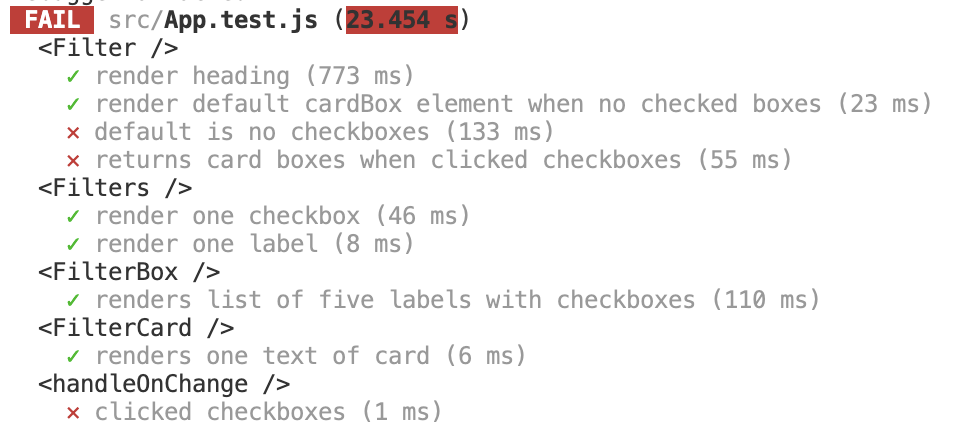

# INFO 443 Project: Analyzing UW LookUP codebase

UW Library LookUp is a React app group project made in INFO 340 Fall 2021. It was made by Katherine Poch, Chris Cha, Zhiwei Zhong. This report is specifically choosing to
analyze the [Filter Feature page](https://uw-library-lookup-1c2ce.web.app/filter) of this React App.

## Code Structure Analysis

**_What are the code-level architectural elements of the system?_**

||
|:--:|
| _Figure 1: Architectural Element Diagram_|
>This UML structure diagram shows the structure of the Filter React Component
of this React App and its functions

This table refers to the Architectural Element Diagram and
defines the purpose of each architectural element of the system to show
what makes up this code structure.

| Architectural Element | Purpose |
| --- | --- |
| `Filter` | The main export function that renders the whole filter page |
| `FilterCardBox` | This function shows the filtered library cards |
| `FilterCard`| This function creates a list of library info cards|
| `FilterBox`| This function creates a list of library feature labels with clickable boxes to filter from|
| `Filters`| This function represents each filter label on the page and handles the changed state of the checkboxes with `handleOnChange`|
| `handleFilterBox`| This function represents the actual result of filtered libraries from the user's checked boxes, which sets the state variable `filterResult`|
| `filterCheckedArray`| This state variable represents the array of features checked by the user|
| `filterLabels`| This state variable represents the features of libraries (gets data from .json file)|
| `libFeatures`|This state variable represents the libraries and what features they are associated with (gets data from .json file).

**_What are the code's process flows?_**

| |
|:--:|
| _Figure 2: Codebase Process Flow Diagram_|
>This UML sequence diagram shows the process of the filter component and how it interacts
its functions. It starts with the user giving input by clicking checkboxes and it
ends with app rendering the output, which are the filtered names of libraries.

This text description reports the process flow, referring to Codebase Process Flow Diagram. It walkthroughs the information "flow" of the system to describe its internal behavior when someone uses this software.

_Code's Process Flow_ : The user starts by visiting the Filter page of the React app and clicks on checkboxes to filter libraries by different features. Clicking on the checkboxes will cause the checkboxes' state to be updated with the `handleOnChange` helper function, which is used by the `Filters` function that creates one library feature and its checkbox.`FilterBox` uses `Filters` to show the list of features and its checkboxes, keeping track of their states. `FilterBox` sets `filterCheckedArray` to be an array of what features were checked. Then, `handleFilterBox` uses `filterCheckedArray` to determine
the filtered library names based on the checked features and the given data .json file saved in the `libFeatures` state variable. The filtered library names are set in `filterResult` state variable and `FilterCardBox` uses it to create the displayed library cards once the App re-renders its page.

## Architecture Assessment

There are structural problems that can be identified in this code. There are
architectural deficiencies, such as code smells, or things that just need improvement.

- The `FilterCard` function is unnecessary since it is mostly DOM level code that can be copied and pasted into the `FilterCardBox` function.
- The variable `comparisonResult` is made but never used.
- There are quite a few debugging console.log comments
- While documenting the structure and control flow, I got confused and lost when looking at what `Filters`, `FilterBox`, and `handleFilterBox` mean and how they all work together. The function names made it unclear that they were dealing with the feature labels with checkboxes. Inside these functions, there was also an obscure prop named `func`, which made reading the code more unclear.

The code is generally readable and well-documented. There are short comments that explain the overall purpose of each function. However, there isn't too many comments because the code is able to explain its architecture on its own. The code look readable because none of the functions are too long or complex and they each have their own single purpose.

There are no standard violations that apply to the codebase being analyzed.
There are no additional design qualities (other than modifiability) required of the codebase being analyzed. If I were to add another feature to this code, I would add a button to clear all the checkboxes, so that you don't have to refresh the page to clear all them.

## Unit Tests

The test can be found in project-1-kvpoch/project-kvpoch-main/src/App.test.js. To run the tests, type `npm run test` in the terminal.

||
:--:|
| _Figure 3: Unit Testing_|
>Unit Testing image shows the result after running the nine tests for this code.

Unit tests are created to to ensure that the code is functional for refactoring and improving code to be easier. I created nine tests, but I unfortunately could not figure out how to write the tests in a way to get them all to pass. Below is the tests I made and the intended purpose of each test.

 **`<Filter />`**

 | Test | Why |
 | --- | --- |
 render heading |Checks to see if the page renders the correct heading
 |render default cardBox element when no checked boxes| Checks if page renders default card box with no library name
 |default is no checkboxes | Checks to see if checkboxes are defaulted to not being checked
|returns card boxes when clicked checkboxes | Checks to see a different library card is returned when you check a box|

**`<Filters />`**

| Test | Why |
| --- | --- |
|render one checkbox| Checks to see if one checkbox is created for one feature
|render one label | Checks to see if one text label is created for one feature

  **`<FilterBox />`**

  | Test | Why |
  | --- | --- |
  | renders list of five labels with checkboxes | Checks to see if the feature list is created correctly with an array of five text labels and five checkboxes |

**`<FilterCard />`**

  | Test | Why |
  | --- | --- |
  | renders one text of card | Checks to see if the text content of library card is rendered correctly|

  **`<handleOnChange />`**

  | Test | Why |
  | --- | --- |
  | clicked checkboxes | Checks if check boxes do change when clicked |

**Coverage**

 ||
 :--:|
 | _Figure 4: Testing Coverage Report_|
 >The Testing Coverage Report image shows the coverage report (before refactoring) for the unit tests made and ran on the FilterPage.js code.

The tests do not cover 100% of the code because around lines 21-40 deal with the using the `useEffect()` to import data, which I decided not to test on.

## Refactoring the Code

The purpose of this table is to show what refactoring can be done to this code.
It identifies each code smell and how to rewrite the code to fix this system's architecture while retaining the same level of functionality.

| Code Smell | What/Where it was | How to Fix |
| --- | --- | ---|
| Lazy Element | `FilterCard` | Copy its code and paste it into `FilterCardBox`
| Speculative Generality | `comparisonResult` (inside `handleFilterBox`) Line 79| Take out the variable since it never gets used
|Mysterious Name| `Filters`, `FilterBox` `handleFilterBox`| Change       `Filters` => `FilterFeatures`,  `FilterBox` => `FilterFeaturesList`            `handleFilterBox` => `handleFilterFeaturesList`
|Mysterious Name| `func` prop in (in `Filters`, `FilterBox`)| Change to `whatToDoWhenChecked`
|Duplicated Code| `Filters` and `FilterBox`| Combine code into one function
|Comments|console.log comments (inside `handleFilterBox`, `FilterCardBox`, `Filters`)| Extract console.log() since they are just debugging comments
> Speculative Generality and Comments code smell refactoring can be found in the original code (project-1-kvpoch/project-kvpoch-main/src/FilterPage.js). Lazy Element  code smell refactoring can
be found in Refactoring.js (project-1-kvpoch/project-kvpoch-main/src/Refactoring.js). I decided not to refactor this code smell in the original code because it would change the structure in a way that would not allow a few of the unit tests to work. I also decided not to refactor the Mysterious name code smell in the original code because the unit tests would also not be able to pass.
