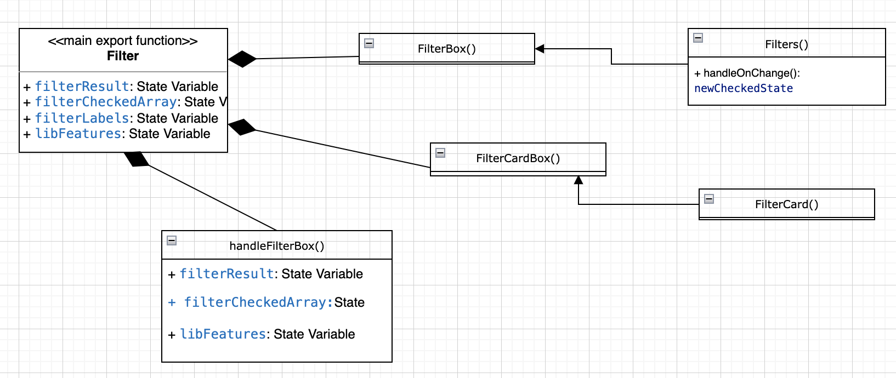
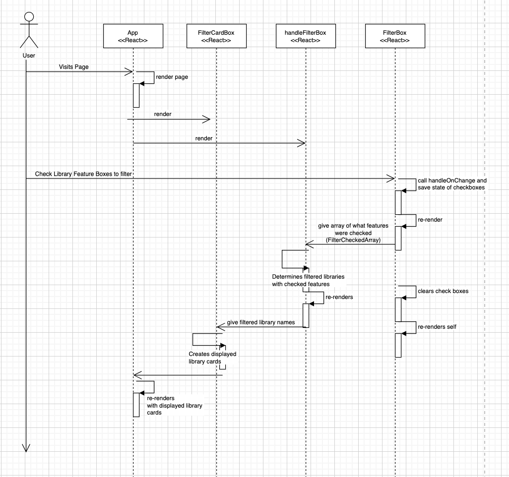

# INFO 443 Project: Analyzing UW LookUP codebase

UW Library LookUp is a React app group project made in INFO 340 Fall 2021. It was made by Katherine Poch, Chris Cha, Zhiwei Zhong.

CODEBASE STRUCTURE DIAGRAM

CODEBASE PROCESS FLOW

